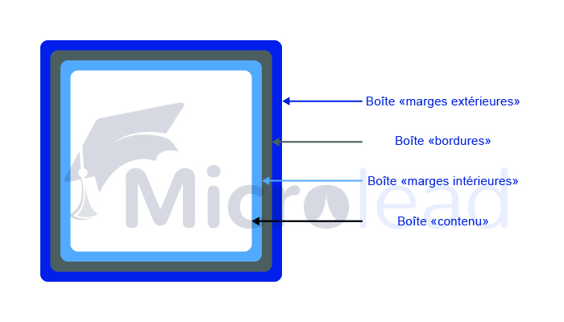

Le terme “modèle de boîte”, en CSS, est utilisé pour désigner le design et la mise en page des éléments HTML et d’une page web. 

Tous les éléments HTML peuvent être considérés comme des boîtes, contenues les unes dans les autres. 

## Le modèle de boîte en CSS

Le modèle des boîtes en CSS signifie que chaque élément est contenu dans un autre, ce qui est souvent imagé par des boîtes dans d’autres boîtes. Le modèle de boîte contient les marges extérieures, les bordures, les marges intérieures et le contenu. Chaque partie est une boîte, contenant la partie précédente et contenue dans la partie suivante : le **contenu** se trouve dans la boîte **marge intérieure**, elles-mêmes contenues dans la boîte **bordures**, elle-même contenue dans la boîte **marge extérieure**.

Voici la définition de chacune des “boîtes” :

- **Contenu** : le contenu de la boîte. C’est l’endroit où le texte et les images apparaissent
- **Marges intérieures** : Définit une zone, un espace intérieur autour de l’élément. Les marges intérieures sont transparentes. Elles ne sont pas matérialisées sur la page. 
- **Bordures** : c’est une bordure qui entoure le contenu et les marges intérieures
- **Marges extérieures** : définit un espace autour de l’élément, à l’extérieur de celui-ci.

Ainsi qu’une image permettant de comprendre visuellement ce concept :



Le modèle de boîte permet d’ajouter une bordure autour d’un ou plusieurs éléments HTML, et d’espacer ces éléments entre eux.

Exemple :

```css
p {
    border : 5px solid black;
    padding : 10px;
    margin : 50px;
    max-width : 70%;
}
```

Dans cet exemple, chaque paragraphe (qui est un **contenu**) de la page est **entouré d’une bordure** avec une épaisseur de 5 pixels. **À l’intérieur de cette bordure**, le texte ne touche pas la bordure, car les **marges intérieures** sont réglées à 10 pixels. Enfin, chaque bordure entourant les paragraphes sera espacée de 50 pixels, les **marges extérieures** étant définies à 50 pixels.

## Hauteur et largeur d’un élément 

Afin de pouvoir définir la largeur et la hauteur correcte d’un élément, dans tous les navigateurs, il est important de comprendre comment fonctionne le modèle de boîte. 

__Remarque__ : Il est important de comprendre que lorsque la hauteur et la largeur d’un élément est définie, il s'agit simplement de la hauteur et de la largeur de la zone de contenu. Pour calculer la **taille totale** d’un élément, il faut **ajouter les marges extérieures et les marges intérieures ainsi que l’épaisseur des bordures gauche et droite**. 

Exemple :

```css
p {
    border : 5px solid black;
    padding : 10px;
    margin : 50px;
    max-width : 800px;
}
```

Dans cet exemple, la **largeur du contenu du paragraphe** est de 800 pixels. Cependant, la **largeur totale** de l’élément paragraphe est de 930 pixels. Voici le détail du calcul :

**Largeur totale = largeur du contenu + marge intérieure droite + marge intérieure gauche + marge extérieure gauche + marge extérieure droite + bordure gauche + bordure droite
**
Ainsi, pour calculer la hauteur totale d’un élément HTML, il suffirait également d’appliquer la formule suivante :

**hauteur totale = hauteur du contenu + marge intérieure supérieure + marge intérieure inférieure + marge extérieure supérieure + marge extérieure inférieure + bordure supérieure + bordure inférieure
**