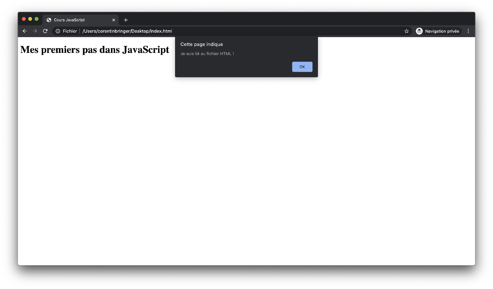
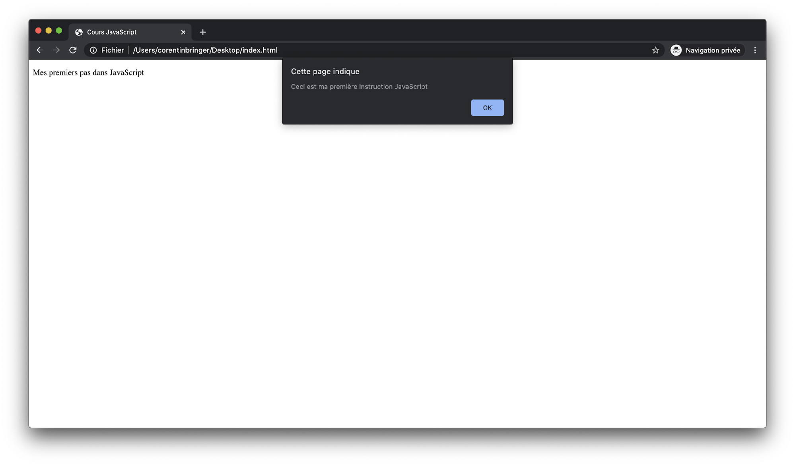

Il est possible d’écrire du JavaScript à 3 différents endroits au sein d’une page HTML. Tout d’abord dans la balise ```<head>```, ensuite dans la balise ```<body>``` et enfin dans un fichier JavaScript séparé.

La dernière méthode est la méthode la plus utilisée, mais vous pourrez également être amené à écrire du code JavaScript dans un des autres éléments. Il est important de noter plusieurs points avant d’aller plus loin :

- Les fichiers ne contenant que du JavaScript doivent tous posséder l’extension “.js” (de la même manière que le “.html” pour les fichiers HTML.

- Une bonne pratique veut que le code JavaScript soit le plus facile à exporter dans un fichier séparé.

- Une autre bonne pratique encourage à placer le code JavaScript à la toute fin de la balise ```<body>``` pour des questions de référencement et de rapidité de chargement de page.

- Placer le code JavaScript dans la balise ```<head>``` peut certaines fois être nécessaire, mais c’est une pratique à proscrire autant que possible. Si vous utilisez le code d’une personne qui stipule la nécessité de placer le JavaScript à cet endroit, suivez ces recommandations tout de même si possible.

## Principes généraux

De façon générale, le code JavaScript au sein d’un fichier HTML doit s’écrire entre les balises ```<script></script>```. Ce sont ces balises qui vont permettre à votre navigateur de comprendre qu’il doit exécuter le code qui s’y trouve en tant que JavaScript.

De même, le code JavaScript, qu’il soit placé dans la balise ```<head>``` ou ```<body>``` du HTML, doit toujours être positionné juste avant la fermeture de celle-ci.

Pour la suite de ce cours, nous utiliserons la structure HTML basique suivante : 

``` html
<!DOCTYPE html>
<html lang="fr">
<head>
    <meta charset="UTF-8">
    <meta name="viewport" content="width=device-width, initial-scale=1.0">
    <title>Cours JavaScript</title>
</head>
<body>
    <h1>Mes premiers pas dans JavaScript</h1>
</body>
</html>
```

## Dans la balise <head> d’une page HTML

Afin d’écrire notre première instruction JavaScript, nous allons placer la balise ```<script>``` à la fin de la balise ```<head>``` et nous allons y placer l’instruction alert() qui permet d’afficher un message dans une boîte de dialogue.

``` js
<script>
    alert('Ceci est ma première instruction JavaScript');
</script>
```

Nous obtenons donc le code suivant : 

``` js
<!DOCTYPE html>
<html lang="fr">
<head>
    <meta charset="UTF-8">
    <meta name="viewport" content="width=device-width, initial-scale=1.0">
    <title>Cours JavaScript</title>
    <script>
        alert('Ceci est ma première instruction JavaScript');
    </script>
</head>
<body>
    <h1>Mes premiers pas dans JavaScript</h1>
</body>
</html>
```

Il ne reste plus qu’à ouvrir le fichier HTML dans votre navigateur et vous devriez voir la boîte de dialogue apparaître comme dans l’exemple qui suit :



## Dans la balise <body> d’une page HTML

Comme dans l’exemple précédent, nous allons reprendre le fichier HTML de référence et cette fois déplacer la balise ```<script>``` ainsi que son contenu non pas à la fin de l’élément head, mais du ```<body>```.

Vous devriez donc obtenir ce résultat dans votre fichier HTML :

``` js
<!DOCTYPE html>
<html lang="fr">
<head>
    <meta charset="UTF-8">
    <meta name="viewport" content="width=device-width, initial-scale=1.0">
    <title>Cours JavaScript</title>
</head>
<body>
    <h1>Mes premiers pas dans JavaScript</h1>
    <script>
        alert('Ceci est ma première instruction JavaScript');
    </script>
</body>
</html>
```

Vous pouvez rafraîchir la page HTML dans votre navigateur et vous devriez normalement obtenir le même résultat que la méthode précédente.

À noter qu’il est possible d’écrire plusieurs balises ```<script>``` dans une page HTML. Dans la mesure du possible, il est préférable d’en intégrer le moins possible, mais il n’est pas rare de devoir intégrer de multiples scripts JavaScript.

Voici un exemple de l’intégration de deux balises ```<script>``` dans un seul fichier HTML. Ainsi le navigateur va les interpréter dans l’ordre où ils sont écrits, de la même manière que vous liriez le code en tant qu’humain. Vous pouvez essayer avec le code ci-dessous :

``` js
<!DOCTYPE html>
<html lang="fr">
<head>
    <meta charset="UTF-8">
    <meta name="viewport" content="width=device-width, initial-scale=1.0">
    <title>Cours JavaScript</title>
</head>
<body>
    <h1>Mes premiers pas dans JavaScript</h1>
    <script>
        alert('Je suis l'instruction numéro une');
    </script>
    <script>
        alert('Et moi je suis la deuxième');
    </script>
</body>
</html>
```

## Dans un fichier JavaScript séparé

La troisième méthode d’insertion de JavaScript au sein d’un code HTML consiste en l’extraction de ce code dans un fichier JavaScript (possédant donc l’extension “.js”), puis au chargement de ce fichier dans le HTML, toujours grâce à l’utilisation de la balise ```<script>```.

Cette méthode présente plusieurs intérêts : 

- En premiers lieux, cela permet d’organiser votre code d’une meilleure façon, et de pouvoir retrouver son intégralité dans des fichiers uniquement JavaScript.
- La séparation des langages HTML et JavaScript vous permettra dans de nombreux cas de faciliter votre développement.
- Le fait d’exporter un code JavaScript dans un fichier dédié permettra sa réemployabilité dans d’autres fichiers HTML si besoin.

La première étape est donc de créer un fichier que l’on nommera “script.js” dans le même dossier que celui où se trouve votre fichier HTML. Nous pouvons alors lier les deux fichiers ensemble : il suffit pour cela de rajouter une balise ```<script>``` avec l’attribut “src” qui contiendra le chemin de votre fichier JavaScript par rapport à votre fichier HTML.

Vous devriez donc avoir votre fichier HTML qui ressemble à ça :

``` js
<!DOCTYPE html>
<html lang="fr">
<head>
    <meta charset="UTF-8">
    <meta name="viewport" content="width=device-width, initial-scale=1.0">
    <title>Cours JavaScript</title>
</head>
<body>
    <h1>Mes premiers pas dans JavaScript</h1>
    <script src="script.js"></script>
</body>
</html>
```

Pour le fichier JavaScript, il faut inclure l’ensemble du code concerné, à savoir :

``` js
alert('Je suis lié au fichier HTML !');
```

À noter que dans un fichier JavaScript - possédant l’extension “.js” - vous n’avez plus besoin de renseigner les balises ```<script>```. Le résultat sera donc le même qu’auparavant :



Il est tout de même important de bien comprendre une chose : le fait d’exporter votre code JavaScript dans un fichier externe au HTML ne changera pas fondamentalement l’exécution dudit code. En effet, lorsque vous renseignez la balise ```<script>``` et notamment la source du fichier externe à inclure grâce à l’attribut “src”, votre navigateur va en réalité inclure l’ensemble du code disponible dans le fichier JavaScript au sein de votre HTML. Il va en quelque sorte “inclure” le contenu JavaScript entre les balises ```<script>```. C’est donc pour cela que vous obtiendrez le même résultat lorsque vous intégrerez le JS directement dans le HTML ou bien dans un fichier dédié.

L’emplacement de la balise script est importante, et en suivant les bonnes pratiques, vous devez alors placer l’ensemble de votre code JavaScript dans des fichiers séparés, en pensant bien autant que possible à placer les balises ```<script>``` de chargement de ces fichiers tout à la fin de l’élément ```<body>```.

## Conclusion

En conclusion, vous pouvez donc écrire du code JavaScript dans l’élément ```<head>```, ```<body>``` et aussi faire appel à un fichier JavaScript séparé. Restez toujours attentif au fait qu’un résultat attendu n’est pas forcément signe de code “propre”, et qu’il est toujours préférable d’avoir un code qui respectera les bonnes pratiques.
