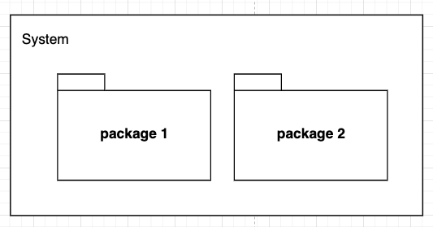

## Informations génériques

- **Type** : Diagramme Structurel
- **Périmètre** : Fonctionnel
- **Langages** : Tous

## Définition / Utilisation

Le diagramme de packages est un diagramme qui permet de représenter un **regroupement** de différents éléments. Il est généralement utilisé en lien avec les diagrammes de classe (par exemple pour organiser les classes par fonctionnalités) et les diagrammes de cas d’utilisation (par exemple pour trier ceux-ci par champ d’action). Il peut cependant être utilisé avec n’importe quel élément répertorié en UML.

Les diagrammes de packages peuvent également s’imbriquer entre eux (un package peut contenir un autre package, et ainsi de suite…). Ces diagrammes incluent trois types de relation : 

- **Import** : Permet de mettre en évidence l’import de tous les éléments publics d’un package depuis un autre. Les éléments ainsi importés pourront donc être retransmis aux autres packages par la suite, étant alors considérés comme “publics” également dans le package d’import.
- **Access** : Symbolise l’accès aux éléments publics d’un package de la part d’un autre. L’accès aux éléments diffère de l’import dans le sens où les éléments accessibles ne pourront pas être retransmis par la suite à d’autres packages, puisqu’ils seront considérés “privés” lors de l’accès.
- **Merge** : Symbolise la fusion des éléments de deux packages différents.

## Formes et symboles

| Symboles | Signification |
| --- | --- |
|  | Symbole du package |
| --- | Symbole d’appartenance à un package. Le rond est positionné sur le package “conteneur”, tandis que la flèche pointe vers l’élément qui lui appartient. |
| --- | Symbole d’import. La pointe de la flèche désigne le package dont les éléments seront importés. |
| --- | Symbole d’accès. La pointe de la flèche désigne le package contenant les éléments rendus accessibles. |
| --- | Symbole de fusion. La pointe de la flèche désigne le package dont le contenu sera fusionné. |