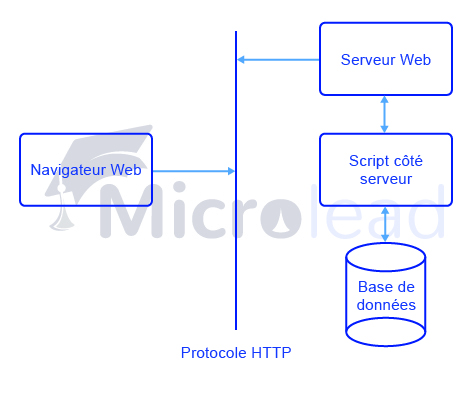

Le protocole de transfert hypertexte (HTTP) est un protocole de niveau application pour les systèmes informatiques Il s'agit de la base de la communication de données pour le World Wide Web (c'est-à-dire l'internet) depuis 1990. HTTP est un protocole générique et sans état qui peut être utilisé à d'autres fins en utilisant des extensions de ses méthodes de requête, de ses codes d'erreur et de ses en-têtes.

Fondamentalement, HTTP est un protocole de communication basé sur TCP/IP, qui est utilisé pour livrer des données (fichiers HTML, fichiers d'images, résultats de requêtes, etc.) sur le World Wide Web. Le port par défaut est TCP 80, mais d'autres ports peuvent également être utilisés. Il fournit un moyen normalisé pour les ordinateurs de communiquer entre eux. Les spécifications HTTP précisent comment les données des requêtes des clients sont construites et envoyées au serveur, et comment les serveurs répondent à ces requêtes.

## Caractéristiques de base

Il existe trois caractéristiques de base qui font de HTTP un protocole simple mais puissant :

- HTTP est sans connexion : Le client HTTP, c'est-à-dire un navigateur, lance une requête HTTP et, une fois la requête effectuée, le client attend la réponse. Le serveur traite la demande et renvoie une réponse, après quoi le client coupe la connexion. Ainsi, le client et le serveur ne se connaissent que pendant la demande et la réponse en cours. Les demandes ultérieures sont effectuées sur une nouvelle connexion, comme si le client et le serveur ne se connaissaient pas.
- HTTP est indépendant du média : Cela signifie que tout type de données peut être envoyé par HTTP tant que le client et le serveur savent comment traiter le contenu des données. Il est nécessaire que le client et le serveur spécifient le type de contenu en utilisant le type MIME approprié.
- HTTP est sans état : Comme mentionné ci-dessus, HTTP est sans connexion et c'est un résultat direct de HTTP étant un protocole sans état. Le serveur et le client ne sont conscients l'un de l'autre que pendant une requête en cours. Ensuite, ils s'oublient l'un l'autre. En raison de cette nature du protocole, ni le client ni le navigateur ne peuvent conserver les informations entre les différentes requêtes sur les pages Web.

__Remarque__ : HTTP/1.0 utilise une nouvelle connexion pour chaque échange de demande/réponse, alors que la connexion HTTP/1.1 peut être utilisée pour un ou plusieurs échanges de demande/réponse.

## Architecture de base

Le diagramme suivant montre l'architecture de base d'une application Web et indique où se situe le protocole HTTP :

Le protocole HTTP est un protocole de demande/réponse basé sur l'architecture client/serveur où les navigateurs web, les robots et les moteurs de recherche, etc. agissent comme des clients HTTP, et le serveur web comme un serveur.

### Client

Le client HTTP envoie une demande au serveur sous la forme d'une méthode de demande, d'un URI et d'une version de protocole, suivie d'un message de type MIME contenant des modificateurs de demande, des informations sur le client et le contenu éventuel du corps du message via une connexion TCP/IP.

###Serveur

Le serveur HTTP répond par une ligne d'état, comprenant la version du protocole du message et un code de réussite ou d'erreur, suivie d'un message de type MIME contenant des informations sur le serveur, des méta-informations sur l'entité et le contenu éventuel du corps de l'entité.
