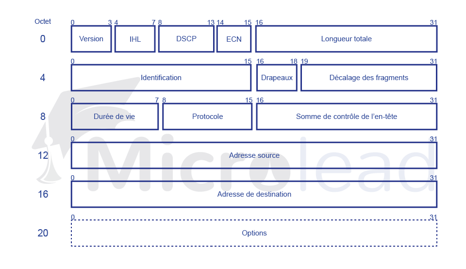

Le protocole Internet est un protocole de couche 3 (OSI) qui prend des segments de données de la couche 4 (Transport) et les divise en paquets. Le paquet IP encapsule l'unité de données reçue de la couche supérieure et l'ajoute à ses propres informations d'en-tête.

