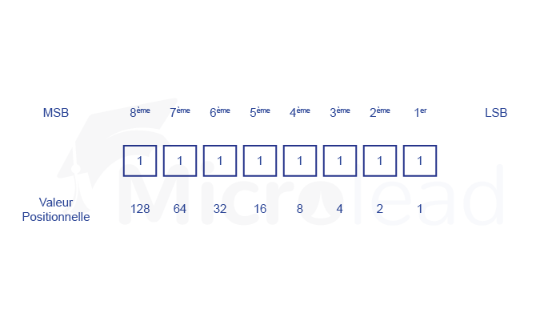

IPv4 prend en charge trois types de modes d'adressage différents.

## Mode d'adressage unicast

Dans ce mode, les données ne sont envoyées qu'à un seul hôte de destination. Le champ Adresse de destination contient l'adresse IP à 32 bits de l'hôte de destination. Dans ce cas, le client envoie des données au serveur ciblé.

